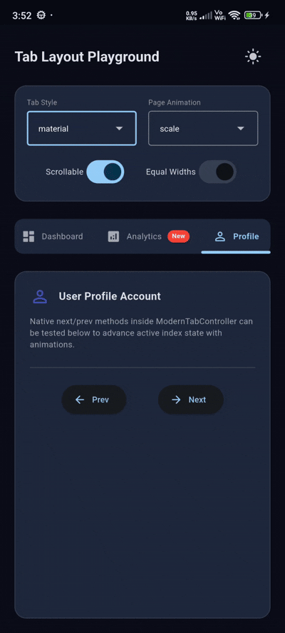

# flutter_tab_layout_library

[](https://flutter.dev)
[](https://opensource.org/licenses/MIT)
[](#)

**flutter_tab_layout_library** is a premium, highly customizable, and interactive real-time sliding tab layout library for Flutter. It features responsive sliding indicators, beautiful custom visual styles, synchronized page navigation, and seamless page transitions.

---

## 📷 Preview

<p align="center">
  
</p>

*A premium sliding tab indicator library featuring custom painting, real-time gesture tracking, scroll views, and animations.*

---

## ✨ Features

- **📊 Responsive Sliding Indicators**
  - Dynamically calculates tab widths using layout bounds and linear interpolates indicator coordinates (`left` and `width`) based on the swiping progress.
  - Features smooth real-time tracking of user drag gesture offsets.
- **🎨 Premium Visual Styles**
  - Select from 6 predefined design styles: Material, Pill, Gradient, Glassmorphism, Floating Card, and Underline.
  - Features highly customizable backgrounds, border radii, and elevated drop shadows.
- **🔄 Synchronized PageView Navigation**
  - Combines sliding tab bars with high-performance PageView layouts.
  - The shared `ModernTabController` keeps clicks and page drag swipes fully in sync.
- **✨ Animated Page Transitions**
  - Supports 5 real-time transition animations: None, Slide, Fade, Scale, and SlideFade.
- **🚀 Advanced Layout Options**
  - Toggles for scrollable tab bars (`isScrollable`) with viewport auto-centering.
  - Support for equal-width tabs (`equalWidths`) fitting custom view grids.

---

## 📦 Installation

To use this library in your Flutter project, add it to your `pubspec.yaml` dependencies:

```yaml
dependencies:
  flutter:
    sdk: flutter
  # From pub.dev
  flutter_tab_layout_library: ^0.0.1
```

Or reference it directly from a Git repository:

```yaml
dependencies:
  flutter_tab_layout_library:
    git:
      url: https://github.com/your_username/flutter_tab_layout_library.git
      ref: main
```

---

## 🚀 Usage

Import the package in your Dart code:

```dart
import 'package:flutter_tab_layout_library/flutter_tab_layout_library.dart';
```

### 1. Simple Standalone Tab Bar
Use the tab controller to coordinate active indices.

```dart
final ModernTabController _controller = ModernTabController(length: 3);

ModernTabBar(
  tabs: const [
    TabItem(title: 'Home', icon: Icons.home),
    TabItem(title: 'Settings', icon: Icons.settings),
    TabItem(title: 'Profile', icon: Icons.person),
  ],
  controller: _controller,
  theme: const TabThemeData(),
)
```

### 2. Tab Bar with Gradient Pill Styling
Configure the selected tab indicator to slide as a capsule pill painted with custom linear gradients.

```dart
ModernTabBar(
  tabs: const [
    TabItem(title: 'Dashboard'),
    TabItem(title: 'Stats'),
    TabItem(title: 'User Profile'),
  ],
  controller: _controller,
  style: TabStyle.gradient,
  theme: TabThemeData(
    backgroundColor: Colors.white,
    indicatorColor: Colors.blue,
    borderRadius: BorderRadius.circular(30),
  ),
)
```

### 3. Integrated Tab Layout with Page Transitions
Deploy a complete swipeable view stack with custom slide-fade page animations:

```dart
ModernTabLayout(
  tabs: const [
    TabItem(title: 'Overview', icon: Icons.dashboard),
    TabItem(title: 'Messages', icon: Icons.mail, badge: '5'),
  ],
  controller: _controller,
  style: TabStyle.glass,
  animation: TabAnimation.slideFade,
  children: const [
    Center(child: Text('Overview Dashboard')),
    Center(child: Text('Messages Inbox Feed')),
  ],
)
```

---

## 🛠️ API Reference

### `ModernTabLayout` properties:

| Property | Type | Default | Description |
| :--- | :--- | :--- | :--- |
| `tabs` | `List<TabItem>` | required | List of tabs items containing titles, icons, and badges. |
| `children` | `List<Widget>` | required | The list of pages/children widgets inside the page view. |
| `controller` | `ModernTabController` | required | The synchronized controller. |
| `theme` | `TabThemeData` | `TabThemeData()` | Custom visual values (backgroundColor, selectedColor, colors). |
| `position` | `TabPosition` | `TabPosition.top` | Places the tab bar at the `top`, `bottom`, `left`, or `right`. |
| `style` | `TabStyle` | `TabStyle.material` | The visual type: `material`, `pill`, `gradient`, `glass`, `floating`, `underline`. |
| `animation` | `TabAnimation` | `TabAnimation.slide` | Page swiping transition style: `none`, `slide`, `fade`, `scale`, `slideFade`. |
| `isScrollable` | `bool` | `false` | Enable horizontal scroll wrapping with auto-centering actions. |
| `equalWidths` | `bool` | `true` | Equal sizes layout grid allocation (ignored if `isScrollable` is true). |

### `ModernTabController` methods:

| Method | Return Type | Description |
| :--- | :--- | :--- |
| `select(int index)` | `void` | Changes selection to target index and animates the view stack. |
| `next()` | `void` | Increments selection to next page (clamped to bounds). |
| `previous()` | `void` | Decrements selection to previous page (clamped to bounds). |
| `animateTo(int index)` | `void` | Smoothly animates both state index and underlying page views. |
| `jumpTo(int index)` | `void` | Jumps instantly to the target page index. |
| `reset()` | `void` | Returns index selection instantly back to initial selected index. |

---

## 📄 License

```lic
MIT License

Copyright (c) 2026 Excelsior Technologies

Permission is hereby granted, free of charge, to any person obtaining a copy
of this software and associated documentation files (the "Software"), to deal
in the Software without restriction, including without limitation the rights
to use, copy, modify, merge, publish, distribute, sublicense, and/or sell
copies of the Software, and to permit persons to whom the Software is
furnished to do so, subject to the following conditions:

The above copyright notice and this permission notice shall be included in all
copies or substantial portions of the Software.

THE SOFTWARE IS PROVIDED "AS IS", WITHOUT WARRANTY OF ANY KIND, EXPRESS OR
IMPLIED, INCLUDING BUT NOT LIMITED TO THE WARRANTIES OF MERCHANTABILITY,
FITNESS FOR A PARTICULAR PURPOSE AND NONINFRINGEMENT. IN NO EVENT SHALL THE
AUTHORS OR COPYRIGHT HOLDERS BE LIABLE FOR ANY CLAIM, DAMAGES OR OTHER
LIABILITY, WHETHER IN AN ACTION OF CONTRACT, TORT OR OTHERWISE, ARISING FROM,
OUT OF OR IN CONNECTION WITH THE SOFTWARE OR THE USE OR OTHER DEALINGS IN THE
SOFTWARE.
```
